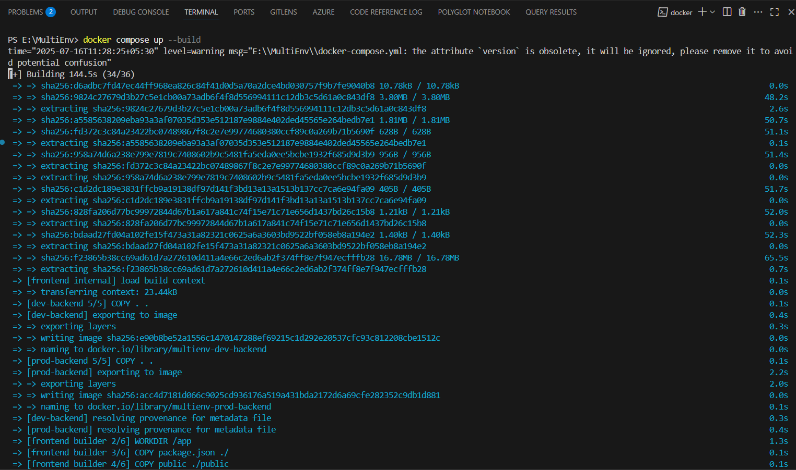
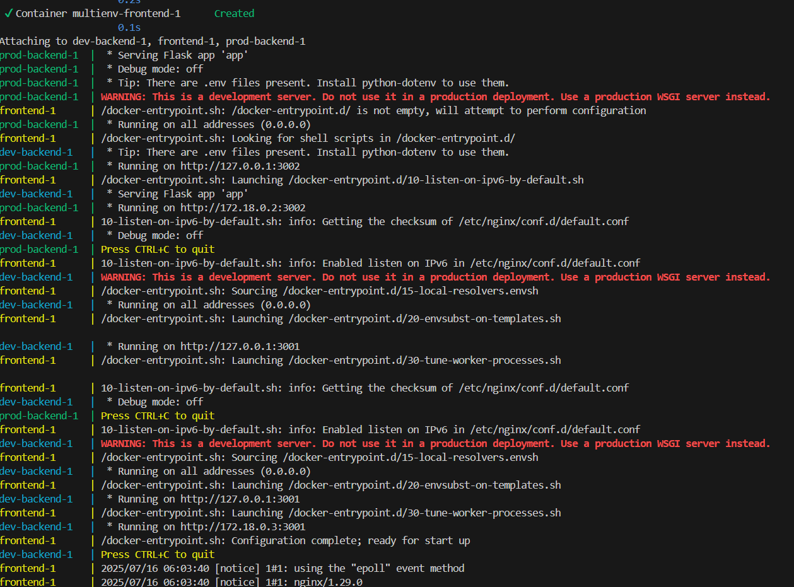
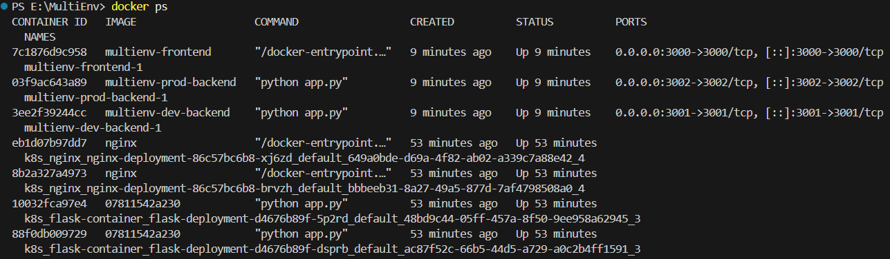
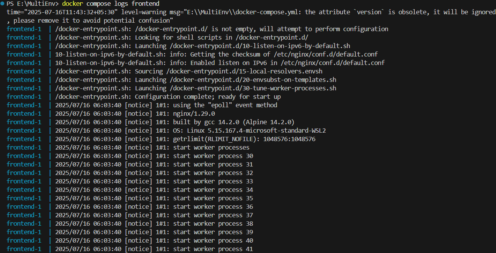
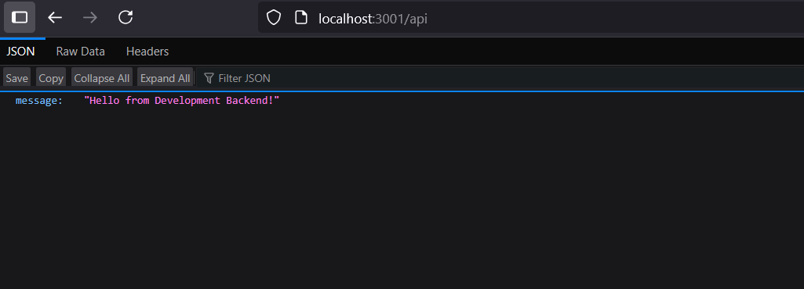
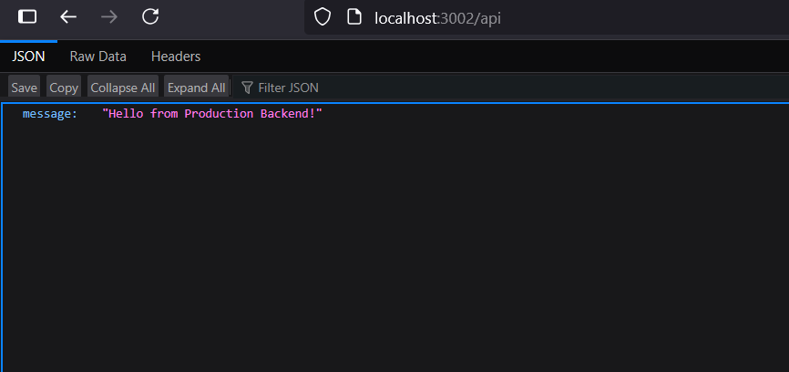

# 🧭 Multi-Environment Ticket Management Deployment

This project demonstrates deploying a **multi-environment web application** using Docker and Docker Compose.  
It includes:

- ✅ A React frontend
- ✅ Flask Development backend (port 3001)
- ✅ Flask Production backend (port 3002)

The frontend communicates with both backends and displays their responses.

---

## 🗂️ Project Structure

multiEnv/
├── docker-compose.yml
├── backend/
│   ├── dev/
│   │   ├── app.py
│   │   ├── Dockerfile
│   │   ├── requirements.txt
│   └── prod/
│       ├── app.py
│       ├── Dockerfile
│       ├── requirements.txt
└── frontend/
    ├── Dockerfile
    ├── package.json
    ├── public/
    │   └── index.html
    └── src/
        ├── App.js
        └── index.js


---

## 🚀 Quick Start

### 🛠 Prerequisites

- Docker installed
- Docker Compose installed

### ▶️ Run the App

```bash
cd multiEnv
docker compose up --build

```

## Application URLs
| Service          | URL                                                    |
| ---------------- | ------------------------------------------------------ |
| Frontend         | [http://localhost:3000](http://localhost:3000)         |
| Dev Backend API  | [http://localhost:3001/api](http://localhost:3001/api) |
| Prod Backend API | [http://localhost:3002/api](http://localhost:3002/api) |

## Functionality
Frontend displays two buttons:

    “Fetch from Dev Backend” — calls Flask Dev API

    “Fetch from Prod Backend” — calls Flask Prod API

Responses are rendered in the UI

## Dev API Output
```bash 
{
  "message": "Hello from Development Backend!"
}
```

## Prod API Output
```bash

{
  "message": "Hello from Production Backend!"
}

```

## Port Configuration
| Component | Docker Container Port | Host Port |
| --------- | --------------------- | --------- |
| Frontend  | 80 (NGINX)            | 3000      |
| Dev API   | 3001                  | 3001      |
| Prod API  | 3002                  | 3002      |

## Screenshots








